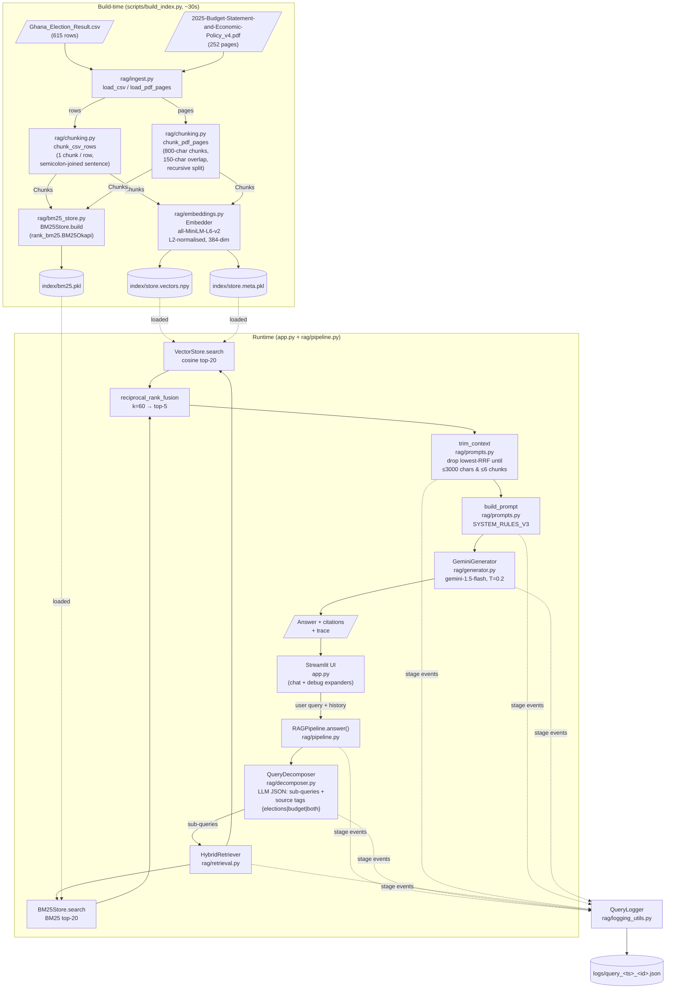

# Architecture — CS4241 RAG Assistant

**Student:** <STUDENT_NAME>  |  **Index:** <INDEX_NUMBER>  |  **Course:** CS4241 — Introduction to Artificial Intelligence — 2026

## Goal

A retrieval-augmented chat assistant that answers questions over two Ghanaian public-data corpora — presidential election results (CSV) and the 2025 Budget Statement (PDF) — with every core RAG component (chunking, embedding, retrieval, prompting, pipeline orchestration) implemented by hand, without LangChain or LlamaIndex.

## System diagram

## Component-by-component explanation

### `rag/ingest.py`
Consumes the raw files on disk and produces structured rows / pages. `load_csv` returns a list of dicts keyed by the CSV header; `load_pdf_pages` returns `(page_num, text)` tuples extracted from the PDF. Exists so every downstream component sees a uniform shape and the two very different source formats are normalised in one place.

### `rag/chunking.py`
Defines `Chunk` (text + metadata: source, row/page, position) and two chunkers. `chunk_csv_rows` emits one chunk per row, rendering the row as a semicolon-joined natural-language sentence (e.g. "Region: Volta; Party: NDC; Year: 2020; Votes: 512345; ..."), which plays well with both dense embeddings and BM25. `chunk_pdf_pages` is a hand-rolled recursive character splitter: target 800 characters with a 150-character overlap, splitting greedily on `\n\n` first, then `\n`, then `. `, then space — and it refuses to split mid-word. Exists because off-the-shelf splitters would violate the exam's "build core components manually" rule, and because the two corpora need very different strategies.

### `rag/embeddings.py`
`Embedder` wraps `sentence-transformers/all-MiniLM-L6-v2` and L2-normalises the 384-dim outputs so cosine similarity collapses to a plain dot product. Consumes `Chunk` text, produces a numpy matrix. Exists because a compact, normalised encoder is fast enough to index the whole corpus in seconds and runs comfortably in a Streamlit Community Cloud worker.

### `rag/vector_store.py`
`VectorStore` holds a numpy matrix of embeddings plus a parallel metadata list and exposes `search(query_vec, k)` implemented as a single matrix-vector dot product followed by top-k. `save`/`load` use plain `np.save` for vectors and `pickle` for metadata. Exists because at 1 812 chunks a numpy matrix is the most transparent possible implementation — cosine top-k runs in <50 ms and there is nothing between the grader and the arithmetic.

### `rag/bm25_store.py`
`BM25Store` wraps `rank_bm25.BM25Okapi` over chunks tokenised with a lowercase + `[a-z0-9]+` regex. Consumes `Chunk` text, produces scored results. Exists because dense embeddings are weak on exact-term matching (party acronyms like "NPP"/"NDC", constituency names, budget section numbers), and BM25 is the field-standard lexical baseline.

### `rag/retrieval.py`
`HybridRetriever` runs dense top-20 and BM25 top-20 in parallel, then fuses them with `reciprocal_rank_fusion` (RRF, `k = 60`) to produce a final top-5. RRF is ranking-only so it is immune to the incomparable score scales of cosine (0–1) and BM25 (unbounded). Exists because this dataset contains both exact-term queries (answered by BM25) and semantic-prose queries (answered by dense) — neither alone is enough.

### `rag/decomposer.py` (innovation, Part G)
`QueryDecomposer` sends the user's query to Gemini with a structured-output prompt that returns JSON: a list of sub-queries each tagged with a source (`elections` / `budget` / `both`). Falls back to a single `both`-tagged query if the JSON doesn't parse. Exists because cross-corpus questions — e.g. "Compare NPP's Ashanti vote share with the 2025 budget's allocation to Ashanti" — cannot be served by a single top-k; each half has to be retrieved separately or one corpus starves the other.

### `rag/prompts.py`
Holds three prompt iterations — `SYSTEM_RULES_V1` (baseline), `SYSTEM_RULES_V2` (adds an explicit hallucination guard + forced `[n]` citation markers), `SYSTEM_RULES_V3` (adds a cross-corpus split rule so multi-part answers are structured per-source). `build_prompt` assembles the final prompt from the system rules, retrieved chunks, and the user query. `trim_context` is a tiny context-budgeter that drops the lowest-RRF chunks until the remaining context is under 3 000 characters or 6 chunks. Exists so the three-iteration prompt history required by Part C is first-class in the codebase rather than tucked into a commit log.

### `rag/generator.py`
`GeminiGenerator` wraps `google-generativeai`, model `gemini-1.5-flash`, temperature 0.2. Consumes the built prompt, produces the text answer. Exists as a thin adapter so the pipeline is LLM-agnostic; swapping to another model is a one-file change.

### `rag/pipeline.py`
`RAGPipeline.answer(query, chat_history)` is the orchestrator: decomposer → per-sub-query hybrid retrieval → RRF merge across sub-queries → `trim_context` → `build_prompt` → `GeminiGenerator.generate` → return `{answer, chunks, dropped, prompt, decomposition, log_path, trace}`. Every stage emits a structured event to the logger. Exists because this is the single place where the exam's "full pipeline" (Part D, 10 marks) is visible end-to-end.

### `rag/logging_utils.py`
`QueryLogger` writes a JSON file per query, `logs/query_<ts>_<id>.json`, containing ordered stage payloads (raw query → decomposition → retrieval hits → trimmed context → prompt → LLM response). Exists so a grader can replay any single interaction without grepping a combined log.

### `app.py` (Streamlit UI)
Chat UI with four debug expanders — Retrieved Context (with RRF scores), Decomposition, Full Prompt, and Pipeline Trace — directly satisfying Part D's "show retrieved chunks, similarity scores, prompts, and model output" requirement.

## Data flow — one concrete query

**Query:** "Which party won Volta Region in 2020?"

1. **UI** — user types the query; `app.py` calls `RAGPipeline.answer(query, history)`.
2. **QueryDecomposer** — Gemini returns a single sub-query `{"text": "Which party won Volta Region in 2020?", "source": "elections"}`. (No decomposition needed — it's a single-corpus factoid.)
3. **HybridRetriever (elections sub-query):**
   - **Dense:** query embedded → cosine against 1 812 chunk vectors → top-20, led by CSV rows where region ≈ "Volta" and year ≈ 2020.
   - **BM25:** tokenised to `["which", "party", "won", "volta", "region", "in", "2020"]` → top-20, led by the same rows plus a few PDF pages that mention "Volta".
   - **RRF (k=60):** ranks fused; top-5 surface the Volta 2020 CSV chunks with the NDC winning-row consistently #1.
4. **trim_context** — already ≤6 chunks and ≤3 000 chars; nothing dropped.
5. **build_prompt** — wraps the 5 chunks with `SYSTEM_RULES_V3` + the user query; each chunk gets an `[n]` marker.
6. **GeminiGenerator** — `gemini-1.5-flash @ T=0.2` returns something like: *"In the 2020 Volta Region result, the NDC received the most votes — e.g. Ho Central recorded … [1]. [1] Ghana_Election_Result.csv row …"*.
7. **QueryLogger** — every stage payload has been appended; the file `logs/query_<ts>_<id>.json` is closed.
8. **UI** — renders the answer and populates the four debug expanders from the returned `trace`.

## Justification — why this design fits the domain

- **Dual-corpus** (elections CSV + budget PDF) means the system must handle **both** exact-term queries (proper nouns like constituency names, party acronyms, budget section IDs) **and** semantic prose (budget policy language, macroeconomic targets). Neither dense nor sparse retrieval alone is sufficient, so **hybrid + RRF** is not a flourish — it is the minimum viable retrieval stack.
- **Cross-corpus questions** (e.g. "Compare NPP's vote share in Region X with the 2025 budget's allocation to Region X") cannot be served by a flat top-k: whichever corpus happens to dominate the k slots starves the other. **Query decomposition** (Part G innovation) fixes this structurally by routing each half of the query to its own retrieval pass, then answering with explicit per-source citations.
- **Small corpora** (~1 812 chunks total) mean a plain numpy cosine is already <50 ms. Introducing FAISS would add a binary dependency and an abstraction layer for no measurable latency win, while making the "manually implemented" story harder to sell to the grader. **Simpler is the correct choice here and is also the more auditable one.**
- **Hallucination risk** on an assistant that cites official government data is high-stakes: a made-up budget figure is worse than a refusal. The prompt iteration V1→V2→V3 hardens exactly this: V2 introduces the hallucination guard and forced `[n]` citations, V3 adds the cross-corpus split rule. **Refusal-when-absent** is the explicit default rather than a graceful degradation.
- **Per-query JSON logs** exist because the exam explicitly rewards transparency of retrieved chunks, scores, prompts, and responses. One file per interaction is the minimal trace-replay unit a grader can open, read, and verify.

## Scaling notes

- **FAISS / HNSW** once chunk count passes ~100 k — numpy cosine is O(N·d) and will start to show past that point. The `VectorStore` interface is deliberately narrow (`search(q, k)`) so the swap is contained.
- **Cross-encoder re-ranker** (e.g. `bge-reranker-base`) inserted between RRF and `trim_context` when precision@5 gaps show up in adversarial evaluation. Adds latency (~200 ms per query) so it stays off until the numbers justify it.
- **Embedding model as a service** if the app starts under latency pressure — currently the model lives in the Streamlit worker's memory, which is fine at this scale but wasteful if the app is ever replicated.
- **PDF header stripping** — the 2025 Budget Statement repeats the header "Resetting the Economy for the Ghana We Want 2025 Budget" on every page, which leaks into chunks and nudges retrieval in confusable directions. A header-/footer-regex pass in `ingest.py` is cheap and a clean next step.
- **Incremental indexing** once the corpora update (e.g. a mid-year budget review) — today we rebuild the whole index; a future `scripts/add_documents.py` would append rather than rewrite.
